# Portfolio
**Purpose / target audience**
The purpose of this portfolio is to show my skills and projects to potential employers and other colleges. The website should easily navigable with as few clicks as possible and have clear sections for projects, blogs and the contact form.
    
**Tech stack (e.g. html, css, deployment platform, etc)**
The tech stack for this portfolio is mainly HTML and CSS (with SCSS). However, there is some Javascript being used for the dropdown menu on the mobile version and the hover effects for the projects skills icons. The compiler being used is VS Code and the website is being deployed on Netlify.

**Sitemap**

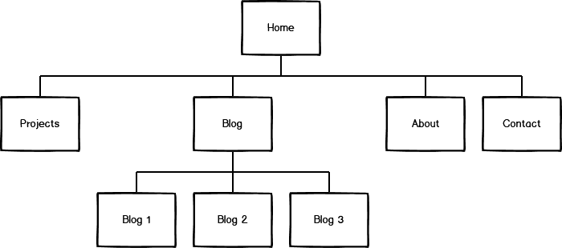

The structure of the site map is shown above. The website starts at the home page with options to go to other page such as the projects page and blog page. In the blog page, there is a list of all of the blog post with links to a separate blog post page.

**Functionality / features**

When the website is visited, the home page is displayed which has a navbar with links to other pages, my name, background image and a footer. The background is a circuit board and relates to my previous experience working with electronics and selected a dark blue colour to be calming and less strain on the eyes. 

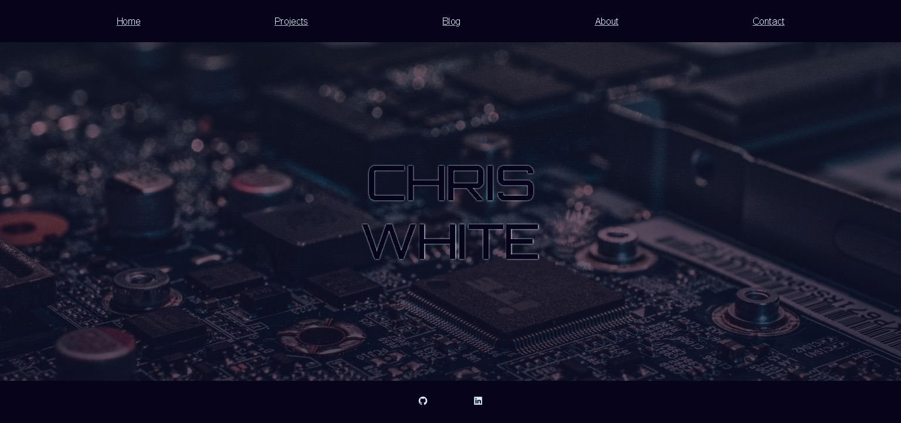

The website has also been designed the work with small screen devices. Instead of the navbar containing a list of links there is a menu (or Hamburger) icon that, when pressed, shows a menu with the links to the other pages. 

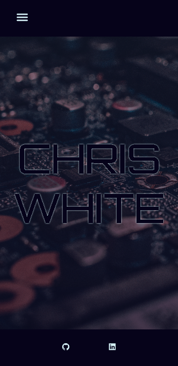
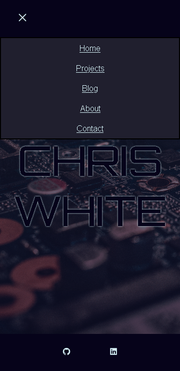

All of the pages are styled in the same way with a navbar, main section and a footer. The main section is a flex container with a flex-direction set to column. This makes it easy to style as each item follows each other vertically and is centered on the page.

The project page shows a list of skills along with a list of projects. The project list item is a grid object to help keep the ratio of the image and description equal with change in screen size.

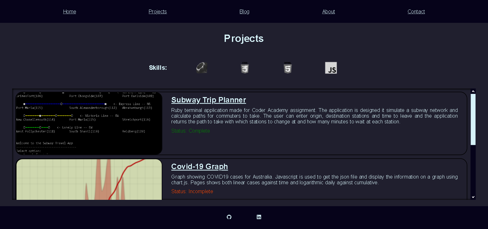

On the large screen version, when the project item is hovered over the skills involved in that project fade in and out.

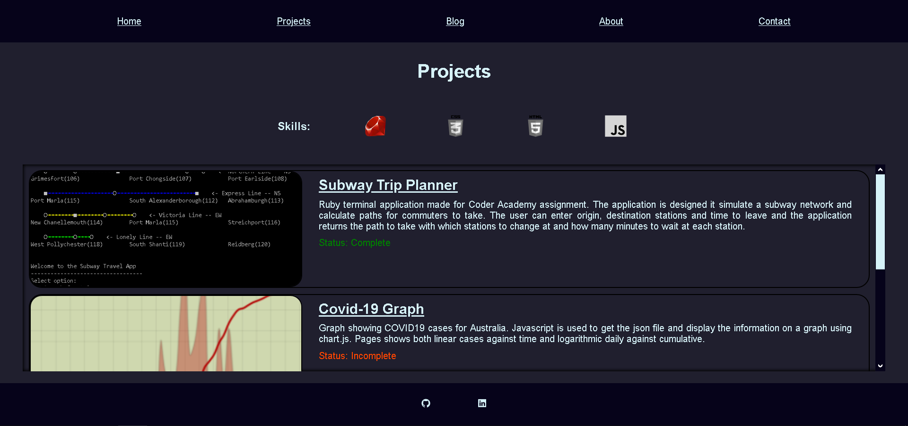

On the mobile version, the orientation is changed to vertical but without any hover effects.

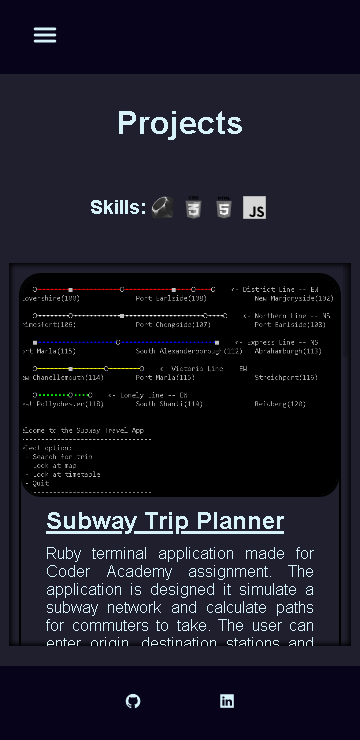

The blog page is styled like the projects page and contains links the the blog post pages.

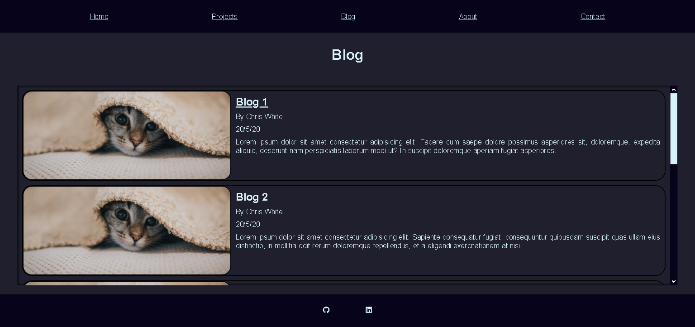

The about page contains information about me and a link to my CV.

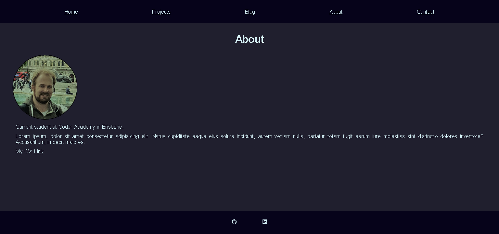

The last page is the contact form. The form has no functionality yet, but it is there as a placeholder.

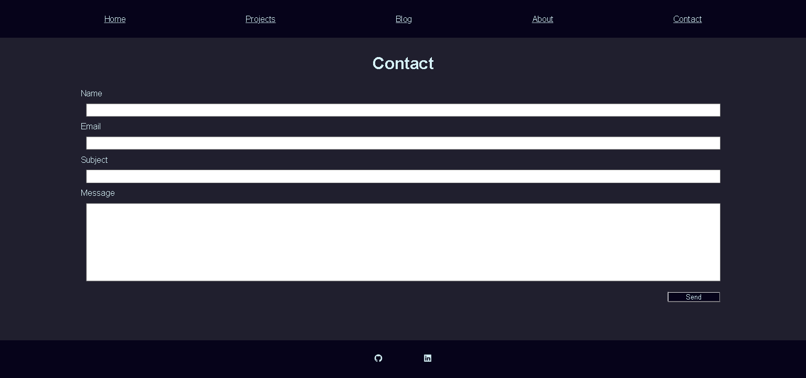

There are other versions of the website on different github branches, mainly changing the colour and font. The first layout is a lighter version of the colours

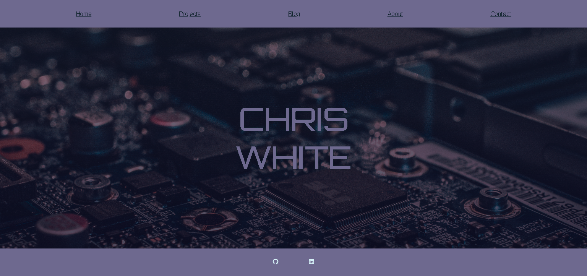

In the second layout, the orange colours are similar the CAD file of the circuit board.

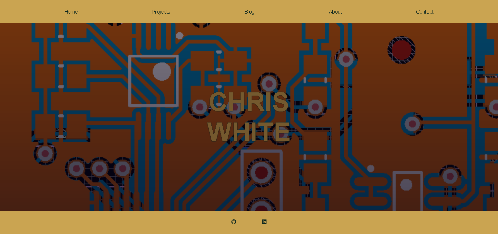

Also in this layout, changing the navbar and footer to have the same colour as the main background. Also, the hover colour of the menu items is changed.

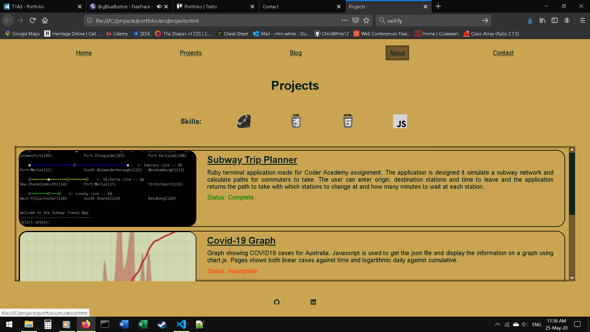

The third layout, changes to green and has the main title in a grid pattern.

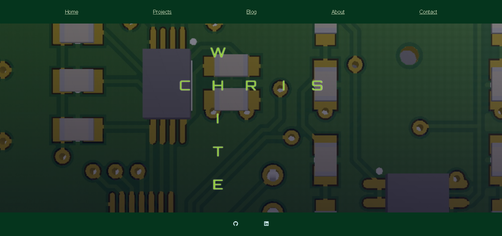

Link to the Netlify page:
https://chriswhite.netlify.app/

Link to the Github account:
https://github.com/ChrisWhite12
